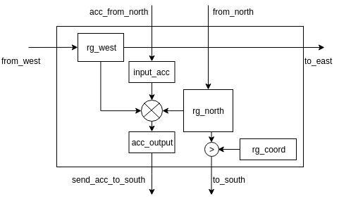
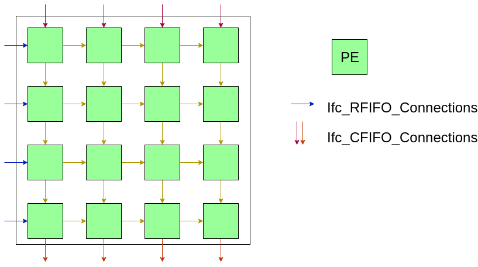
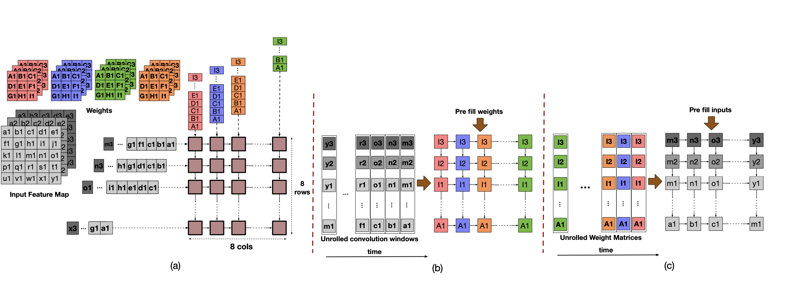

############
Compute Grid
############

Processing Element
------------------

.. _ws_pe:

   Weight Stationary PE

Processing Element (PE) is the smallest unit of logic, which is replicated to a multi-dimensional grid. Each PE contains registers to store one value each of input, weight and output, and performs one **M**\ ultiply-and-\ **AC**\ cumulate operation each cycle using those values to generate one output value. Depending on the way data flows through the compute module, later explained in Section ???, one data-structure out of inputs, weights and the outputs are kept stationary in the PE and the remaining are streamed across the rows and columns of the systolic grid. A schematic representation of weight stationary PE, where weights are chosen as the data-structure that remain stationary within a PE, is depicted in :numref:`ws_pe`.

Within a PE, the flow is synchronous. In the given figure, the input value will move eastward every cycle. Similarly, for the MAC operation to be complete, the output, once computed, should be able to flow to the next PE, typically downwards.

Array of PEs
------------
 
.. _systolic_grid:

   Systolic Grid

 
The above mentioned PE, is replicated along two dimensions, and interconnected along both the dimensions with immediate PEs, as depicted in :numref:`systolic_grid`. In this weight stationary dataflow, input maps flow along the rows from East to West, and output maps flow from North to South.
 
Each row and column, have a FIFO at the start, from where data is sent into the array. These FIFOs are referred as RowFIFO and ColumnFIFO respectively. They provide the access-execute decoupling. If the FIFOs weren't present, the logic which reads data from memory subsystem and sends it to buffer would stall, if there is any stall in systolic array. With access-execute decoupling, number of stalls can be reduced.
 
Dataflows
---------

Three different multi-dimensional vectors (input maps, output maps, weight filters) are involved in the convolution operation. One of them is first populated into the systolic grid, with each PE holding one or few values throughout the entire computation. Based on which of the three stays *stationary* inside the PE, the dataflow can be classified into input stationary (parts of input is stored in each PE), output stationary (parts of output is accumulated and stored inside each PE) and weight stationary (weight is stored in each PE). :numref:`dataflows` gives one possible mapping of a feature map and a weight filter for each possible stationary configuration.
 
.. _dataflows:

   Different Systolic Dataflows (a). Output Stationary (b). Weight Stationary (c). Input Stationary

Tensor ALU
----------

The Tensor ALU is similar to the vector ALUs present in modern processors, and supports tensor operations. The tensor ALU performs other operations that correspond to a DNN such as activation functions, batch-normalization, etc. that cannot be performed on the systolic array. In addition the same tensor ALU can also be reused for performing multi-level vector reduction of partial sums across the channels.
 
.. %TODO: Write advantages and disadvantages of each
.. %\subsection{Design space}
.. %Based on the area and timing targets, different parameters could be varied.
.. %
.. %\begin{enumerate}
.. %    \item Size of systolic grid (Rows, Columns) can be varied according to the area budget, to get proportional performance.
.. %    \item Similarly, given a number of PEs fit a certain area budget, different spatial orientations (1D, 2D, 3D, etc.) can be explored to find the best configuration.
.. %    \item In addition, the bit-precision of inputs, weights and outputs can be varied to trade-off accuracy vs (performance/power/area).
.. %    \item Finally, the dataflow pattern can also be varied for different input sizes and systolic grid dimensions, to find the best performing dataflow. As discussed earlier, certain applications benefit from certain dataflow patterns.
.. %\end{enumerate}
.. %
.. %As a generic implementation, the goal is to have a multi-precision PE, which can simultaneously support multiple dataflows, and find the best dimensions of systolic grid which best fits the area budget.
.. %
.. 
