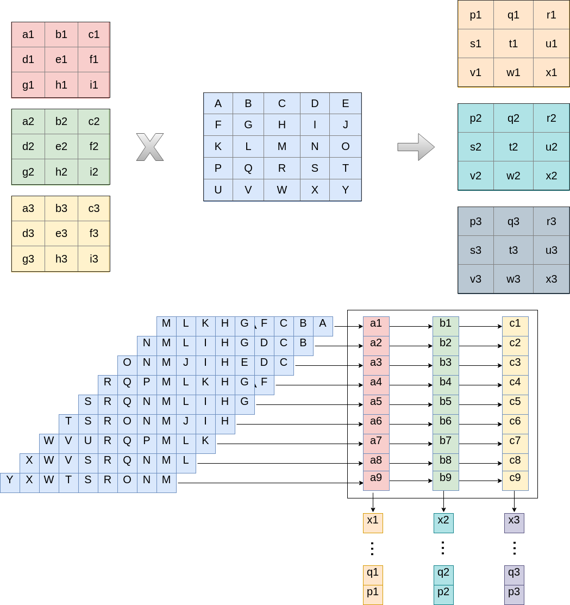

##############################
Mapping DNNs to systolic array
##############################

The Figure :numref:`convolution` depicts an example mapping of a 2D filter over a 2D feature-map onto the proposed systolic array. The weights are unrolled and fed to each columns where they are kept stationary in the PEs. The inputs are streamed across the rows. The output partial-sums are streamed across the columns and are accumulated in the accumulator-buffer. 
There are three key points that need to be considered,

* The addresses to be fetched for weights and input feature maps are provided via the ISA. But, the partial sums need to be stored and accumulated across channels. The addressing of these partial sums need to be handled internally as it is not exposed to the front-end or the control-processor.
* The global-buffer needs to support a bandwidth equal to the number of rows (nRows) in the systolic array, since there are nRows inputs to the systolic array every cycle. There are two ways to handle this problem. 

  1. Perform im2col outside the systolic array and have as many global buffer banks as the number of rows and load the buffers with replicated values. 
  2. Have a replication unit that exploits the fact that many values across rows share the same value, which can be fetched once and replicated across. However, in this approach, edge cases need to be taken care of. The latter approach is akin to having a im2col logic inside the accelerator subsystem. This is the approach we have taken in our design, although extensive verification needs to be performed to make sure that all edge cases are met.

* There is also a need to re-use the tensor-ALU to do the partial sum reduction, as the module is expected not to be busy when convolution operation is being performed as there are no other operations to perform such as normalization or pooling (unless we need to support fused-operators, currently it's not clear how to support these things)

.. _convolution:

   Example of mapping 2D filters and a 2D feature map on our systolic array supporting weight-stationary

