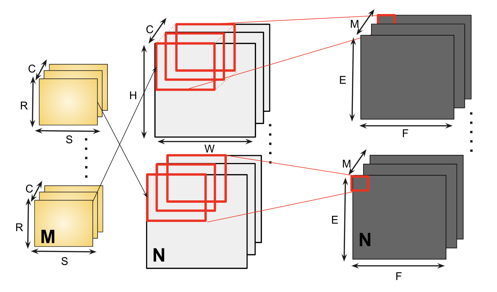
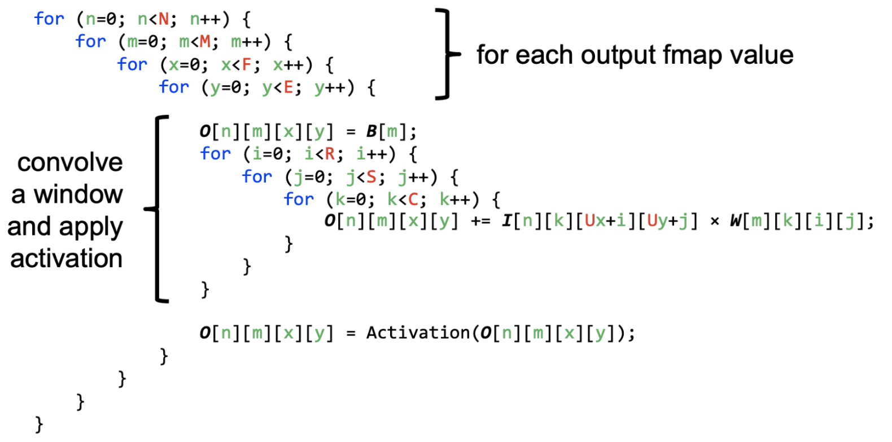

##########
Motivation
##########

The dominant computation of choice in many DNN workloads are either vector-matrix multiplication, matrix-matrix multiplication or convolution. All three operations have high data-parallelism in general and systolic arrays is a better fit for such accelerators. :numref:`conv_op` gives an example and :numref:`convcode` is the 7 dimensional loop that represents a convolution.

.. _conv_op:

   Convolution Operation

.. _convcode:

   7D convolution code (Courtesy: CS6886 Slides)

