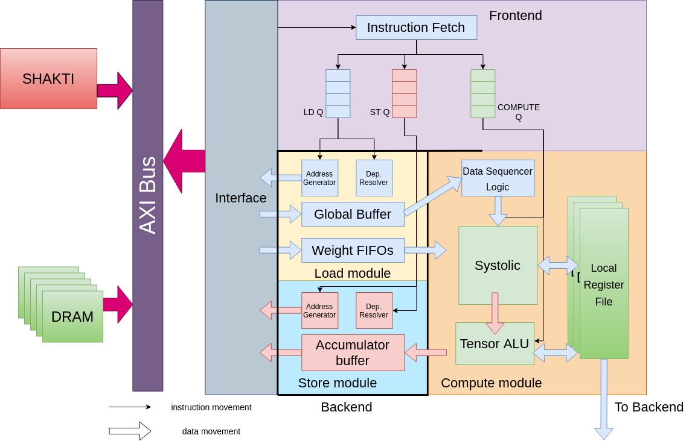

########
Overview
########

The accelerator itself can be divided into three components, namely the compute module, the control and memory subsystem and the interface module. The compute module consists of the multi-dimensional array of Processing Elements (PEs), built as a systolic array. In addition, the module also contains a Tensor ALU, which performs SIMD operations on inputs. The interactions among the three is depicted in :numref:`microarch`.

.. _microarch:

   Microarchitecture of the accelerator

The control and memory subsystem can be split into frontend module and backend module, handling instructions and data respectively. The frontend consists of instruction queues, to which instructions are fetched from the interface module, and finally dispatched to the compute module. The backend contains buffers for storing input and output feature maps and filters. The frontend and compute module communicate using a set of micro-ops, which store the configuration parameters of operation to be executed on the grid. 

Lastly, the interface module manages the communication with the core (to configure registers) and memory (to send/receive data). The interface module connects the accelerator sub-system to DRAM and other associated storage. In addition, it also connects the base control processor with the accelerator sub-system. The module sends/receives data to/from buffers in the memory subsystem. 
