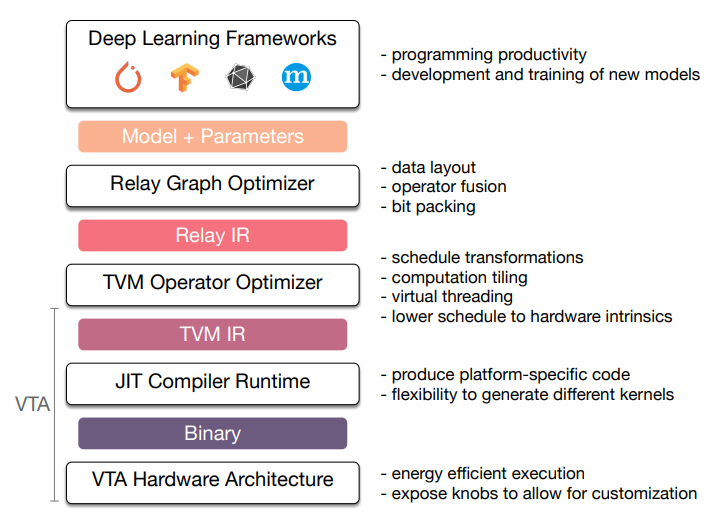

######################
Programming model: TVM
######################

TVM is an open Deep Learning compiler stack for CPUs, GPUs, and specialized accelerators. It takes a high-level specification of a deep learning program from existing frameworks and generates low-level optimized code for a diverse set of hardware back-ends. TVM is able to produce better performance over hand-tuned libraries for each accelerator. TVM achieves this using three modules.

1. TVM has a tensor expression language to build operators and provide program transformation primitives that generate different versions of the program with various optimizations. This layer extends Halide’s compute/schedule separation concept by also separating target hardware intrinsics from transformation primitives, which enables support for novel accelerators and their corresponding new intrinsics. Moreover, they introduce new transformation primitives to address GPU-related challenges and enable deployment to specialized accelerators. They can then apply different sequences of program transformations to form a rich space of valid programs for a given operator declaration. 
2. TVM introduces an automated program optimization framework to find optimized tensor operators. This framework takes in the hardware configurations as input, and generates low-level operations, which best-fit the given hardware (memory tiling size, task schedule, etc.). The optimizer is guided by an ML-based cost model that adapts and improves itself, as it collects more data from a hardware backend. 
3. On top of the automatic code generator, TVM has a graph rewriter that takes full advantage of high-level and operator-level optimizations.

TVM Compiler Stack - A brief overview
-------------------------------------

Most high-level deep learning frameworks (TensorFlow, PyTorch, etc.) return a computational graph. TVM converts this graph into Relay IR. After some optimizations, it is reduced to a further lower level referred to as TVM IR. This TVM IR is machine agnostic, and at runtime, is passed through a JIT compiler to obtain assembly-level code.

.. _vtastack:

   TVM Stack

Instruction Set and its dissection
----------------------------------

To enable a faster compiler flow of our systolic array, we standardize our array with that of the VTA architecture. Before delving into the proposed standardization, we take a small detour into the existing configuration register set of our accelerator which will be replaced with the instructions once the front-end is in place.

Existing Configuration Register Space
^^^^^^^^^^^^^^^^^^^^^^^^^^^^^^^^^^^^^

* **FilterDims** : This register holds the dimensions of the 3D filter (rows, columns, channels)
* **IfmapDims** : This register holds the input feature-map dimensions 
* **CoordCount** : This register contains the max value of the coordinate value. The coordinate value is sent to every PE that indicates when to stop transferring values from north to south (after weights are populated within the PEs, there is no need to transfer values along the columns. This flow-control is established by the coordinate value).
* **paddingSize** : The register contains the size of padding performed on the hardware (unused currently - it's assumed that the data-structures are padded and loaded)
* **startBit** : This register is responsible for the start of computation. It is written by the control processor before signalling the start of systolic operation
* **InputAddr** : The starting address of input feature maps in global buffer (SRAM).
    
Proposed Instruction Set Architecture based on VTA
^^^^^^^^^^^^^^^^^^^^^^^^^^^^^^^^^^^^^^^^^^^^^^^^^^

* **GEMM** : This instruction signals the start of a matrix multiplication operation over a input tensor and a weight tensor. This is referred to as a systolic fold. The following are the fields in this instruction

  * Opcode (3 bits)
  * Dependence Flags (4 bits): The flags contains dependencies to be handled. Specifically a RAW with a previous LOAD operation and WAR with a subsequent store operation. The dependency resolution modules will handle this after decoding these flags
  * Reset register (1 bit): Resets the configuration of the GEMM core. Flush signal sent to all PEs either systolically or broadcast 
  * Mop begin (2 bits) and Mop end (2 bits): These fields are pointers to the micro-op cache that contains the micro-ops for the given instruction. (We need to figure out what to do!)
  * Iter\_in (14 bits) and Iter\_out (14 bits): The granularity of memory tiling for a particular fold. This is useful in address calculation of tensors (Systolic array may not require this iterator since everything is spatially mapped.. we have to figure out how to use this field)
  * Dst\_Factor\_out and Dst\_Factor\_in: Dimensions of each output tile which is calculated by a single GEMM operation. 
  * Src\_Factor\_out and Dst\_Factor\_in: Dimensions of each input tile which is read by systolic array from global buffer. 
  * Wgt\_Factor\_out and Wgt\_Factor\_in: Dimensions of each weight tile read by systolic array.

**LOAD/STORE** : This instruction is used to load into the systolic buffers and store to the main-memory from accumulator buffer and/or TensorALU. The following are the fields in this instruction

  * Opcode (3 bits)
  * Dependence Flags (4 bits)
  * Buffer-ID (2 bits): To discriminate between global buffer and weight-load phase for load instruction and accumulator buffer for store instruction
  * SRAM (16 bits) and DRAM base address (32 bits): The address in SRAM and DRAM respectively where the corresponding data is stored. Data is moved from DRAM to SRAM in accelerator for LOAD and vice-versa for STORE.  
  * X and Y sizes (16 bits each): X and Y dimensions of the tensor to load 
  * stride (16 bits): For strided load/stores from/to memory 
  * paddings (16 bits): The pad size to be additionally loaded into the SRAM apart from the tensor.

* **ALU** : The ALU instruction performs tensor ALU operations for other layers in the DNN. The fields are similar to that of the GEMM instruction and hence only the additional fields are listed here.

  * ALU opcode (2 bits): Min, Max, Add, shift-immediate
  * use\_immediate (1 bit)
  * immediate (16 bit)
